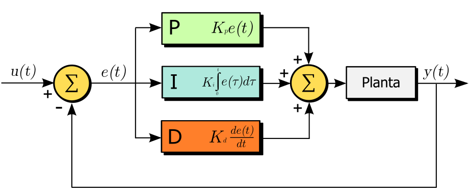

## developing and applying Systems engineering principles to critical systems theory

System change in the current world is essential to face the crises we are in. Systemic social change, however, remains a complex issue with little progress. There are many reasons, but [] proposes systems design, which is designed as:
>Systems design is the process for determining what characteristics a new system should have, resulting in a model of the new system and a plan for creating it

Now, control systems engineering is a mature field, where things that work well and things that do not work well are thoroughly tested. Having the term "control" in a social systems approach feels a bit icky, this will be addressed in safety considerations. For now, to deal with it, I will define the following[^1]:
 - consensual control is nice
 - nonconsensual control is abuse
 - be nice
 - abuse is violence. Violence to stop violence is justifiable, but demands a (optionally retroactive) justice process.


An interesting approach would be to analyze the approaches taken and tools used in control systems engineering with the intention of using these tools in a societal context. These are:
- feedback
- PID control
- laplace transforms
  - resonance
  - resilience
  - pain points
  - being on another wavelength

### feedback
*Feedback* occurs in a system when a process output is fed back into the process in some way. For example, let's assume I wants to control my emotions in some way. I am in a room and the environment makes me feel uncomfortable. A feedback loop in the oversymplified system `Me` could be:

```
/->environment-->feelings-\
\----------actions<-------/
```

Now, I can think about where in this system I have control, and that is only in `actions`. The direct link between actions and feelings (e.g. taking a deep breath is an action that influences feelings directly, but does not change the environment before that). blablabla thingy with environmetn being systems with difficult responses and time changes such as that some actions have a fast effect on the environment, whereas others have a slow effect. Walking out of the room has a very fast effect, while trying to change social dynamics has a slow effect.

### PID control

> PID: a modular, stupidly simple feedback principle that works really well in some pre-defined range.

A PID control system consists of three parts: Propotional, Integral[^2], and Differential feedback. A controller does not need to have all P, I and D components, but they all serve a different purpose, as explained below.
||
|:--:|
|Fig 3. PID diagram|

*Proportional feedback* is a response that is directly proportional to the error `eₜ` or `e(t)` with a proportionality factor `Kₚ`. This is the most intuitive response, and the only response used in the nonconsensual control system called the Dutch state. The Dutch state employs a police force that is allowed, by law, to use proportional violence. Another example is a teacher that develops an escalation ladder to control the behaviour of their students. A consensual example would be telling peoplet, when welcoming, that your living room is shoe-free. Then, when people wear shoes in your living room, tell them to take them off - with varying levels of intensity. And when people don't wear shoes, thank them. P Systems: systems that only have proportional control have two main problems: steady-state error (solved by I) and overshoot (solved by D). It can be explained by the below diagram:
```
feedback is proportional to the number of |'s
----------------rₚ
|||||/----------
||/-/
-/ eₚ
```

*Integral feedback* is feedback based on past experiences. It is applied based 
mainly exists to eliminate steady-state error. It is best explained by the sentence: If I hit you twice, your response will be more intense. below diagram:
```
feedback is proportional to the `x` area:
       /-----\
      /xxxxxxx\--\
-----/--------------rₚ
xxxx/
xxx/
--/ eₚ
```
In social situations, this is equivalent to repetition. Something I often hear is that something is a little bit annoying, but not annoying enough to say something about it. I don't really know at this point what integral feedback would look like. In action climbing, a space is made where people talk about the small (safety) mistakes that were made during that day. This could be a good example: After it was noticed that these itty-bitty things were a problem, a space was created to talk about nitty-bitty deviations from the ideal situation.
A common problem that occurs in a PID controller caused by the I factor is [integral windup](https://en.wikipedia.org/wiki/Integral_windup). Let's imagine a social situation: Alice keeps walking with her shoes on in Bobs house. Alice didn't know this was a problem. Bob has been annoyed for some time already and tells Alice. Then, this emotion stays with Bob for some time and Alice has to overcompensate or do it well a longer time to make Bob happy.

<!-- haar wassen, haren aan de muur, gesprek over haren aan de muur -> appen, extra muur schoonmaken, schuldgevoel als niet schoonmaken. -->


*Derivative* this factor is about responding to change. For example, if Alice always eats apples and then eats a pear, this is a change. In a PID controller, it helps to prevent overshoot and oscillations. In a social context, responding to change is not always needed, especially if overshoot is not a problem. One example where it *is* a problem is if you want to intensify a relationship, but not too close. Then, overshoot can be dangerous, and it becomes important to notice changes in social dynamics. Closely observing *changes in* behaviour (or emotional response to them) becomes important.
A common problem with responding to change in robotics is sensor noise. That is: something may look like a change, but the reason for the change may be wholly unrelated to what you asked for. In signal processing, this is solved by low-pass filtering, but in a social context, this can also be incorporated in the giving-feedback part.
One place where "D = responding to change" in the PID controller analogy breaks down, is positive feedback on change. In a PID controller, giving positive feedback on change will make the universe explode. There is a little difference in definition of "positive feedback" between systems engineering and social contexts here. In a systems engineering context, positive feedback means any self-reinforcing dynamic. In a social context, it means being nice to people based on what they do.
In a social context - especially when behaviour is changing, social positive feedback on change is desired. For example, if someone never does dishes, and starts doing them, then it is nice to give positive feedback (both social-wise and systems-wise), based on this change. One way of thinking about this is that the desired situation is so far away from the actual situation and the system is so slow to respond, that the universe will not explode before this component in the system is changed.

```
       /->|P Kₚe(t)      |--\
rₜ + eₜ|                    ↓ uₜ          yₜ
-->Σ---+->|I Kᵢ∫₀^te(τ)dτ|->Σ-->|process|--->
  -↑   |                    ↑             |
   |   \->|D K∂ₜe(t)    |--/              |
   |                                      |
   \--------------------------------------/
```

#### summary:

implementing PID in a system redesign asks three questions:
- How to respond to an undesirable situation
- How to respond to accumulated nuisances (both in addressing and in dealing with lasting retroactive feedback)
- How to respond to changing behaviour

For a purely engineering approach to answering these questions, see [this robotics question](https://robotics.stackexchange.com/questions/167/what-are-good-strategies-for-tuning-pid-loops)

This is opposed to asking only the first question. Since PID controllers are very effective, I would argue that for a short-term intervention, these questions are enough to reach a desired state.

### Laplace transform and root locus

A very common technique used in systems engineering to get insight into a system is to apply a Fourier, [Laplace or Z](https://math.stackexchange.com/questions/3169159/why-define-the-z-transform-differently-from-the-laplace-transform) transform. All these transforms work similarly, and transform away from the time domain, towards the frequency domain (Fourier) - or some generalization of frequency (Laplace, Z). In social-emotional contexts, I hear people talk about "resonance", "being on another wavelength", "being in tune with each other" etc. These are all frequency-related descriptions of a social phenomenon. Add to that the notion that "time is but a construct of human perception" and that "scientific truths are only perspectives" and we arrive at applying a laplace transform in a social situation, since time doesn't really matter that much when dealing with emotions or societal problems. I don't know if I will go that deeply into the mathematical side of things, because it is rather abstract and not *that* relevant.
The goal of this section is to establish a way to go from social problems in the time domain to the emotional/dream domain and transform these back again into the time domain for solving these problems.

Since the laplace transform is a perspective change, performing a laplace transform in human interaction is not that difficult as a perspective change: Just tell people about the new perspective and propose talking in it. The more relevant question is: What *is* the human Laplace domain? What is this thing where people talk about "resonance", "wavelengths", "being in tune"? I think it is the domain of emotions and trauma and such. 

Now, let's take a look at all the nice things that can be done in the Laplace domain and why this is so useful in engineering control systems. In engineering control systems, the response of [a system](https://en.wikipedia.org/wiki/Linear_time-invariant_system) to any time-varying input signal is determined by the convolution of the impulse response and the input signal. In the laplace domain, convolution becomes multiplication, which is much easier to work with: So easy, even, that transform->multiplication->back-transform is often preferred over directly calculating the convolution. (Davide Consoli sped up some OGH map processing by doing this).

Another aspect of modeled systems transformed to the laplace domain, is that they are now differentiable complex functions.

The nice thing about differentiable complex functions is that they are uniquely determined by their poles and zeroes in the complex plane[^3]. A pole is a place where the function diverges. For example, the function $f(z) = \frac{1}{z}$ has a pole at $z=0$. A zero is a place where the function is zero. For example, the function $f(z) = 1+\frac{1}{z}$ has a zero at $z=-1$ and a pole at $z=0$. The behaviour of a system can be analyzed by plotting the [root locus](https://en.wikipedia.org/wiki/Root_locus_analysis), which is a plot of the roots when some parameter changes, specifically in a feedback system. So, in conclusion, in the Laplace domain, a systems behaviour is determined by the poles and what they do can be analyzed by a root locus.

The next question would be: What are the social poles then, in this Laplace domain? One interesting aspect of (odd) poles, is that the value of the function changes, based on the direction from which you approach the pole. In a lecture about participatory approaches, by Esha Shah, she explained how - when doing interviews for social science - the pain is often where people have different stories about the same subject. I like to see it as a trauma manifesting as adding noise to a communications channel in the time domain. And in the Laplace domain - I would say/define - a trauma or conflict is a pole - by virtue of being different depending on from which direction it is approached.

The final step, is to transform back from the laplace domain to the time domain. This is done through a line integral - the inverse laplace transform. The amazing thing about line integrals of a lot of functions, is that - by the [residue theorem](https://en.wikipedia.org/wiki/Residue_theorem) - they can be determined by integrating around the poles only (if the function doesn't explode at infinity). In the social context, this would mean circling the pain points/trauma, until a plan for the forseeable future emerges from the process. Here's a picture of a complex function, where the poles are 

Ok, that was maybe a lot. here's a bullet list:
- Trauma, emotions, resonance, dreams and the like deeply influence our lives and the dynamics in them.
- Talk about emotions, trauma, resonance, dreams and the like does not make sense in a context where time is also discussed - they are different domains[^4].
- Transforming back to time from emotions, trauma, resonance, dreams and the like can be done by circling around contradictions/trauma/conflict until a plan emerges.

That's all folks! Hope it's useful!

O yes, one more thing: locations of poles and order of poles and stuff like that. In an engineering system, the location of poles is very important, since their location determines stability (whether or not the universe explodes). However, the point of applying a social laplace transform is not to model a social system. The point of a social laplace transform is to provide an alternative perspective into dynamics, so that people themselves can decide on implementing desired control mechanisms. This is because people have a much better sense - intuitive, I may say - of dynamics and their appropriate response. However, if a drawing *is* made of emotions, trauma, resonance, dreams and the like, here's two possible ways of doing it:

```
Laplace field
             |
real pole    |
  ↓   x      |
--x----------+-------Real number line. 
      x      |       Poles on this line will not have an oscillating effect
complex pole |   x<-a pole here will make the universe explode
             |      your objective is to move it to the left of that line <-
             imaginary number line 
```

```
Z field
    /--|--\
   |   |   | <- this is the unit circle. Your ojective is to
-------+------  get all poles inside this circle
   |   |   |
    \--|--/
```

zero more thing: I forgot what exactly I wanted to type here, somethings with ... ah, it's probably not that important now. Ah yes, maybe that the residual of a pole is found by repetitive differentiation. And this is important when integrating over the imaginary axis in the complex domain. Yes, that in solving societal issues, there are two things that can be done: A destabilizing conflict can be solved, this means that the pole ceases to exist. In engineering control systems, this is equivalent to putting a zero on top of a pole. Alternatively, you can do coping mechanisms or a control system, that is in the diagrams above: pushing the poles to the left of the imaginary axis, or into the unit circle. This is a root locus analysis and a bit abstract, because the poles of the entire system start moving in a pre-determined way due to some parameter, but the link between poles and how they move is somewhat difficult to see. Maybe it would actually be useful to have a tool that goes from mapping social dynamics to a laplace transform, but the risk would be that such a tool gives an impression of being exact, while it is absolutely not that.

That would be something like drawing a block diagram of dynamics, where the computer transforms it into the dream domain. Also, this analogy of trauma being a pole in a system completely breaks down at this point, because there are too many variables and no one-to-one mapping between these concepts and a lot of maths, where the idea of this text was to only use the mathematical principles that have proven themselves useful.

### Example: nonsensical[^5] argument for leftist politics

Let's say that the main problem of our world is the unbounded accumulation of capital. This curve does not really have fluctuations, so can be characterized by a pole like this:
```
       |
       |  \ /-this giant X is capitalism
-------+---X---
       |  / \
       |
```
Now, lefty politics try to balance this system, say like this:
```
       |
       |  \ /-this giant X is capitalism
-BIJ1←←←←←←X---
   |   |  / \
   |   |
   BIJ1 is a lefty political party trying to pull capitalism X to the left
```
And right-wing politics keep capitalism in place:
```
       | VVD BBB
       |  \ /-this giant X is capitalism
-BIJ1←←←←←←X---
       |  / \
       | PVV FVD-these are political parties
       |         that keep it in place
```
A lot has been written about capitalism and how to change it. The above is a viewpoint that catches dynamics only very high up in the imperialist capitalist political hierarchy where change is very slow. Let's take a more psychological look: Capitalism - losing ethics bc greed completely takes over a person - is caused by the possibility of accumulation of capital (and some other things). Let's say our person has greed quite well under control:
```
 greed |
   x   |        greed is under control
-------+------  because the poles are
   x   |        to the left of the
       |        imaginary axis
```
But then, the accumulation of capital starts enhancing their tendency for greed:
```
 greed |  /-the capitalist hydra
     x→|→👿
-------+------
     x→|→👿
       |\-is pulling on this pole
```
Until the over-arching system becomes unstable:
```
       | a full-blown capitalist
       | 👿
-------+------
       | 👿
       |
```
And then, in a cooperative session, this person does a therapy and introduces the inner child:
```
 inner | a full-blown capitalist
 child | 👿
-👼----+------
       | 👿
       |
```
They circle around the poles, find the residue (past/intergenerational trauma) and introduce a feedback mechanism to help with the sociopsychological dynamics:
```
       | a healing capitalist
  🧲   |x 👿
-👼----+------
  🧲   |x 👿
       |
```
And over time, the poles move to the left of the imaginary axis:
```
       | a healing capitalist
  🧲x  |  👿
-👼----+------
  🧲x  |  👿
       |
```
Until it is incorporated, the feedback mechanism(🧲) is no longer needed, and good things start sprouting:
```
 👼    | a healed capitalist
 🌱    |       👿
-🌱----+---------
 🟫    |       👿
       |
```
<!-- leraar die je huiswerk nakijkt voorbeeld -->

[^1]: These definitions are *Fuzzy*. Especially *consensual*, *nonconsensual*, *abuse* and *violence*, please see my [overly mathematical consent framework]() for pointers.
[^2]: "Integral" in the mathematical sense, not "integrated" as in "an integrated approach".
[^3]: Now, systems, people and the like are obviously not uniquely determined by their poles and zeroes. In no way am I claiming that a Laplace transform can be used to come closer to human nature or that we have transfer functions, etc. blablabla, I *am* trying to rationalize the irrational and think outside of that box that says that blablabla just fucking understand that frequency stuff and dreams and such are important, mkay? That you can do a lot of things in a domain where time is irrelevant, mkay? But not that this is some other sciency-difficult-language-so-it-is-true thing, mkay?
[^4]: In fact, there is also the [fractional fourier transform](https://en.wikipedia.org/wiki/Fractional_Fourier_transform), which transforms to some intermediate between time and frequency, but I don't know if that will be useful.
[^5]: Nonsensical is funny here, because in Tomas Moore's Utopia's notes of the translator, it is explained that, Utopia means no-land and the entire story of Utopia and the people there is told by a person named _Nonsenso_. Utopia was initially written in Latin (Lateijnsch).