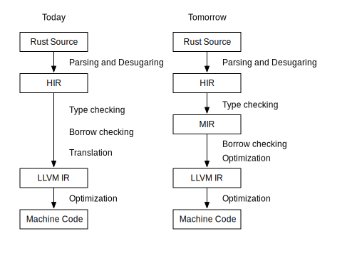
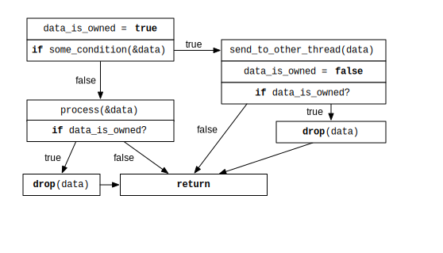
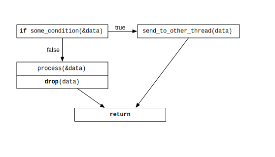

# On high and low-level human communication: Compiling principles to implementations

The highest level of human communication is energetic, which manifests itself as visions. Visions can be transferred through storytelling. [insert Schiller's essay on poetry and geniuses].

In Western society, where social norms are upheld by written law, this does not always work well. I would argue that this is because the law is enforced by force. It was written in 1992 that this doesn't work, in Harry Mulisch's "Discovery of Heaven", where the ten commandmends are taken away from Earth. A big argumentation between the Angels that have received this order, is that the world and all it's people in it - people that have free will - has become too complex to be governed by these commandments. Maybe commanding is not the right way to govern people? It removes autonomy from the people, creates a hierarchial system (the Church) that interprets morals and ethics in a way that bla bla bla colonization bla bla bla erosion of the mind, loss of connection with the Self and the Universe bla bla bla. How can meaning be communicated through language in such a way that it both does not allow for malicious misinterpretation, as well as allowing for filling in the gaps that are created when translating ideas to a different context. The goal of this communication would be organizing and aligning people to cooperate.

blablabla systems thinking blablabla fourier transform blablabla.

Firstly, malicious misinterpretation often has a reason. I would argue that true malice in misinterpretaion bla bla bla see Wetiko legal principles and I personally use my overly mathematical consent framework for the use of violence, bla bla bla transformative justice bla bla. <- in the case of untrusted actors.

let's assume a trusted scenario to not get too involved with Law and such. A good example is the open source community and specifically the Rust community: There is no (explicit) hierarchy, difficult decisions are made through Requests For Comments (RFCs), where anyone in the community has the opportunity to voice concerns, after which an RFC is accepted.

The emergence of principles in communication is an interesting development. I would argue that this stems from the paradigm shift from Industrial age bureaucratic organization towards Information Age Team organization, as described by Reigeluth 2017. Principles can be found in many places, such as [richdem](https://richdem.com/philosophy.html), [Rust design](http://lang-team.rust-lang.org/decision_process.html), [FAIR-TRUST-CARE](), 16 guiding principles and Watson et al. 2008. In all these places, they form an invitation to collaboration, while giving a high-level description of how the underlying system works. In creating a mental picture, they are the first strokes on a blank canvas, where the painting is the concrete implementation.

The next question is: How does this high-level language translate to low-level language: context-specific adjustments within the principles that cater a solution to a situation. One place where high- and low level languages proliferate is computer software: In computer software, the lowest level is machine language. Because very little people speak machine language, many different languages have been constructed on top of that.
The lowest possible level, is hardware description: What transistors to put on a chip so that it is a computer. This is beyond the scope of this argument; we will assume a computer already exsits.
At its core a computer has a CPU, which understands only a select number of machine instructions. These instructions have direct translations in Assembly, which very few people are fluent in.
Then, on top of Assembly, a programming language can be constructed that uses a *compiler* to translate the instructions of the programmer (in the programming language) to machine language. The great thing about this is *portability*: If the compiler understands different hardware systems (aka, it speaks different machine languages), it can translate the same program to different machines (contexts). We will further investigate the compiler later, but first explore higher level languages and constructs.
An alternative to a compiled language, is an *interpreted* language such as Python/Javascript/Bash. In these languages, there is an interpreter that continuously translates the instructions of the programmer to machine language, akin to how a simultaneous interpreter in a conversation helps two people communicate.
Whether interpreted or compiled, software is built in a programming language. By the [Unix design philosophy](https://en.wikipedia.org/wiki/Unix_philosophy), a larger system is made up of smaller components that do only a single thing and interoperate. The highest level of software design is *architecture*. A software architect designs the sub-components needed to solve a complex problem or create a complex program. The interesting part is that this is no longer about human-machine communication, but about human-to-human communication. A computer does not understand diagrams as code, only people do. Then, these people translate the diagrams to code in a team effort.
Lastly, there is also Infrastructure as Code, which is a description for installing and setting up different programs. One example is Docker, which allows a program to be run on any computer that runs Docker. Additionally, a complex server setup can be put in a Docker compose file, which then works - with some configuration -  on any server.

In this landscape, there are two mechanisms at play that enable universal validity of code: Runtime and Compilation/translation. Runtime (Docker, Python, Javascript) is an additional program that needs to run on the user's computer in order to run it. Compilation/translation is the interesting part, because it translates a high-level description (a program in a high-level language) to a low-level implementation. 
A big problem with top-down solutions to societal problems, is that the context is vastly different for every implementation of a solution. Having a large organization with different layers of management and different branches to translate the implementation to each context would be an interpreted language in this analogy.
An alternative approach is bottom-up governance. With bottom-up governance, however, high-level coordination is still required. Thus, I propose to introduce the concept of compilation as a social activity, defined as: Transforming a high-level overview, such as a set of principles, to an implementation, such as a workshop or activity.
Now we have this defined, let's take a look at how compilation is done efficiently and well in the computer world. In the computer world, especially the Rust compiler, firstly the code is transformed into an abstract syntax tree (an abstract representation of what you wrote). This is then translated into a High-level representation, into a medium-level representation, and finally passed on to LLVM Intermediate Representation (LLVM is the actual compiler that translates this into machine code for all the different machines).
||
|:--:|
|Fig. 2 The [compiler stages](https://blog.rust-lang.org/2016/04/19/MIR.html)|

Next, we will analyze what steps happen in each representation and what this would translate to in the context of having principles as a high-level description of how to do things.
In the first transformation, from code to abstract syntax tree, macros are expanded. Macros are pieces of code that *generate* code. In the analogy where principle sets are a high-level description of how to do things, this would be reading (or diagramming) the sub-principles and explanations. 
In the second transformation, from abstract syntax tree to high-level representation, *type inference* is done. This ensures that the code written is consistent. In designing a principle implementation, this would be the stage where paradoxes, contradictions and reinforcements between principles are discovered. Then, if a paradox is found, it requires a change in the principles or a workaround. An example of a paradox would be that the CARE principles dictate: A1`Indigenous data must be made available and accessible to Indigenous nations and communities in order to support Indigenous governance`, as well as A2`be activeleaders in the stewardship of, and access to, Indigenous data especially in the context of Indigenous Knowledge.`, which perceptually contradicts open data sharing (e.g. GEOSS).
At the next level down, borrow checking and optimization happen. Borrow checking is somewhat of a Rust-only concept which has to do with ownership and is an additional constraint specific to the Rust language. Optimization is actually where the interesting stuff happens. I cannot think of a way to translate this to compiling principles to an activity, but it is an additional consistency check for aligning with certain implementation-specific rules.
<!-- Additionally, when translating to the next stage, MIR, control flow is all transformed to use [goto](https://en.wikipedia.org/wiki/Goto) statements. Because of this uniformity, optimizations are easier to implement.  -->
Optimization is a topic that is as complex as the system to be optimized. In the flowcharts below, it can be seen that both `data_is_owned` and two conditionals are dropped, because `data_is_owned` can be statically determined.

In designing an implementation of principles, it can similarly be that one sub-activity ensures adherence to multiple principles, after which another sub-activity that would only help with a subset of those could be omitted.
Additionally, there are many trade-offs in optimization, such as brevity vs clarity or size vs speed. For this reason, there are different options that can be passed to the compiler to prefer one over the other.

how to software:
- describe a problem
- describe a fix to the problem
- specify the fix to the problem
- fix the problem:
  - search for existing solutions
  - glue the blocks together
  - create blocks or glue where it doesn't exist yet
- persist the solution:
  - 

 From a constructivist perspective on knowledge construction, this is a very interesting place to look, since blablabla translation vs transpilation blabla compiler making the translation from high-level language
